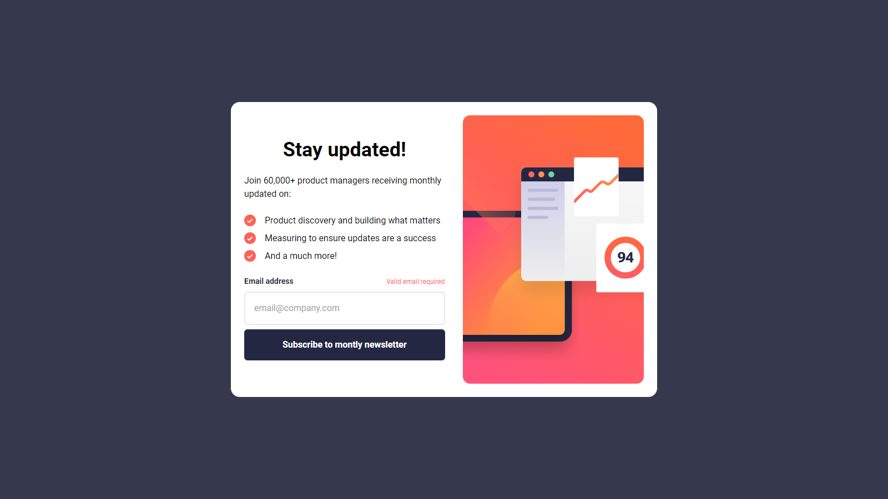
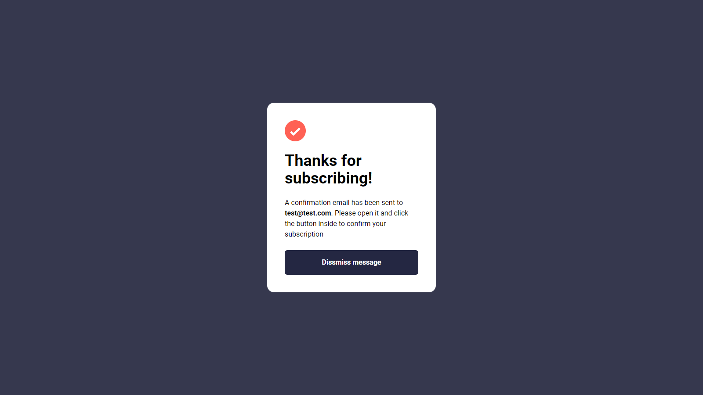

# Newsletter sign-up - Frontend Mentor

This is a solution to the [Newsletter sign-up](https://www.frontendmentor.io/challenges/newsletter-signup-form-with-success-message-3FC1AZbNrv). Frontend Mentor challenges help you improve your coding skills by building realistic projects.

## Table of contents

- [Overview](#overview)
  - [The challenge](#the-challenge)
  - [Links](#links)
- [My process](#my-process)
  - [Built with](#built-with)
- [Author](#author)

## Overview

### The challenge

Your users should be able to:

- Add their email and submit the form
- See a success message with their email after successfully submitting the form
- See form validation messages if:
  - The field is left empty
  - The email address is not formatted correctly
- View the optimal layout for the interface depending on their device's screen size
- See hover and focus states for all interactive elements on the page

### Links

- Solution URL: [Link](https://www.frontendmentor.io/solutions/product-preview-card-component-6mMmIcgsYE)
- Live Site URL: [Link](https://thelaucha.github.io/Newsletter-sign-up-FM/)

## My process

### Built with

- Semantic HTML5 markup
- CSS custom properties
- Flexbox
- Javascript
- Tailwind

## Author

- Website - [Lautaro Espinillo](https://thelaucha.github.io/lautaro_espinillo_portfolio/)
- Frontend Mentor - [@TheLaucha](https://www.frontendmentor.io/profile/TheLaucha)
